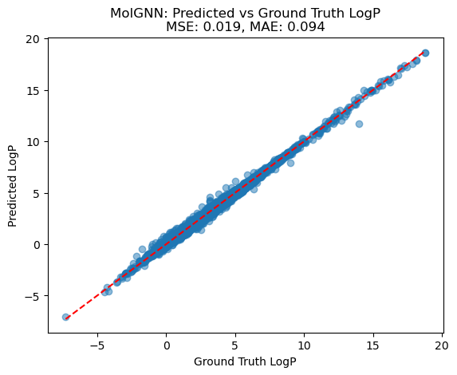

# Practice_GNN4MOL

This repository is my practice project focused on applying Graph Neural Networks (GNNs) to molecular property prediction.


Compared to using SMILES strings or ECFP molecular fingerprints, GNNs offer a more robust way to capture the hidden molecular structure correlation by directly modeling atoms and bonds as nodes and edges in a graph. This graph representation allows GNN to better learn  chemical properties from molecular data.

## How to use the code
You can train it based on your own dataset by adjusting the code line bellow:
```bash
nohup python -m train.train --data_file train_data --props logp --batch_size 100 --max_epochs 10 --learning_rate 1e-5 >> ./logp.log 2>&1 &
```

Evaluation codes is stored in the notebook
## Result (Compared with traditional machine learning model)

### Gradient boosting


### MLP


### Random Forest


### My MolGNN



## Further improvement 

Some other properties could be augmented into the node matrix (descriptors), such as mol weight, formal charge, etc. Also, another important implement is that while current graph matrices can is good enough, the structure of a molecule does not change under several invariances including translation, rotation, etc.  I didn't test these steps due to the time cost, either in the future unless I need to use graph neural network in future works (but might in different applications). If you have test this, you can report it in issue and share the opinion with me🥸.\
For invariance in materials modeling, a notable example is Xie, T.'s work on the CRYSTAL DIFFUSION VARIATIONAL AUTOENCODER FOR PERIODIC MATERIAL GENERATION (CDVAE). This approach leverages invariance properties (such as translation and rotation) in crystal structures to generate periodic materials. For more details, see the CDVAE repository: [https://github.com/txie-93/cdvae](https://github.com/txie-93/cdvae).
